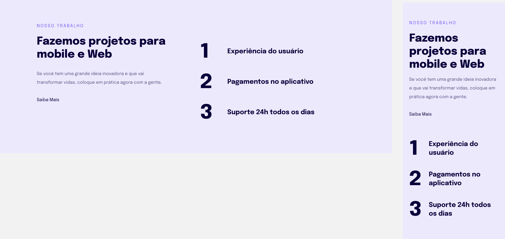

<h1 align="center"> projeto 4  Responsividade</h1>

  <a href="#-tecnologias">Tecnologias</a>&nbsp;&nbsp;&nbsp;|&nbsp;&nbsp;&nbsp;
  <a href="#-projeto">Projeto</a>&nbsp;&nbsp;&nbsp;|&nbsp;&nbsp;&nbsp;
  <a href="#-layout">Layout</a>&nbsp;&nbsp;&nbsp;|&nbsp;&nbsp;&nbsp;
  <a href="#memo-licença">Licença</a>

  

 
  

  
  

## 🚀 Tecnologias

Esse projeto foi desenvolvido com as seguintes tecnologias:

- HTML 
- CSS
- Git e Github
- Figma

## 💻 Projeto

  O Projeto 02 é uma criação de uma Landing-Page básica para fortalecer nosso conhecimento sobre alguns conceitos aprendidos em aula na Rocketseat, entre eles:

  <ul>
  <li>Regra Mobile-First</li>
  <li>Regra das unidades de medidas flexíveis</li>
  </ul>
      
 

- [Visite o projeto online](https://esio1998.github.io/Responsividade/)

 

## 🔖 Layout

Você pode visualizar o layout do projeto através [DESSE LINK](https://www.figma.com/file/N8mENpBsVRJtmzL6ZwZ8AC/Explorer-Stage-03-Projeto-02-(Copy)?node-id=203%3A412&t=fpAy5dWB6jFFeVQb-0). É necessário ter conta no [Figma](https://figma.com) para acessá-lo. 

  

## :memo: Licença

Esse projeto está sob a licença MIT.

---

Feito com ♥ by Esio Almeida :wave: [Participe da comunidade da RocketSeat!](https://discord.gg/rocketseat)
